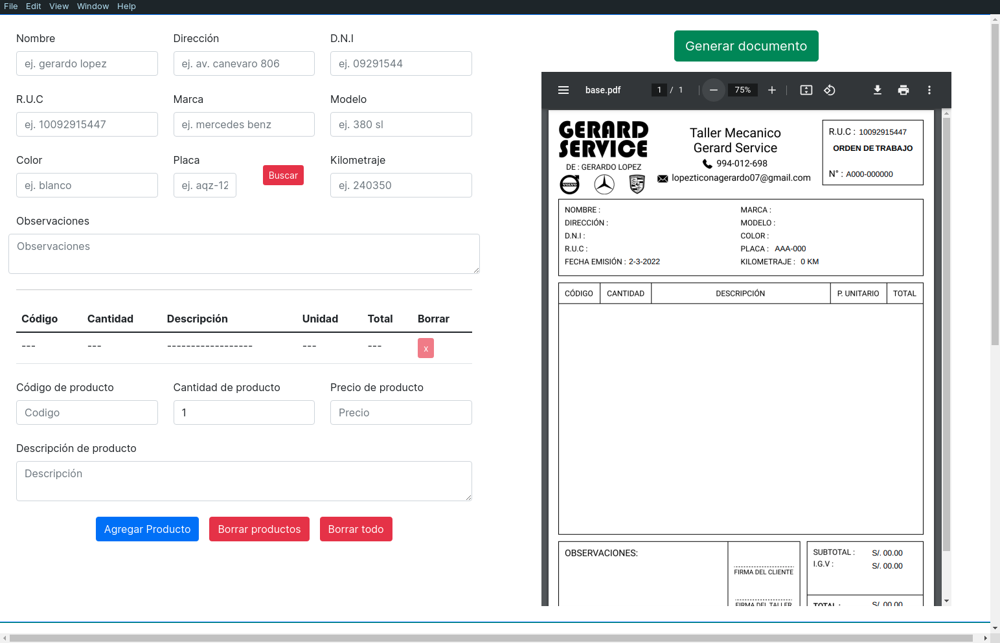

# GS Systems

A desktop application to help with the `generation` and storage of `pdf documents` for a mechanical workshop.

## Table of Contents

- [GS Systems](#gs-systems)
  - [Table of Contents](#table-of-contents)
  - [Objectives](#objectives)
  - [Technologies](#technologies)
  - [Screenshots](#screenshots)
  - [Installation](#installation)
  - [References](#references)

## Objectives

The main goal with this project was made a javascript based desktop application capable of `dynamically generate` and save pdf documents, helping with the easy search of them and a simple way to save some valuable data at the generation moment to `speed up` the user experience.

## Technologies

Some of the technologies that were used to build this project.

- [Electron.js](https://www.electronjs.org/)
- [Bootstrap 5](https://getbootstrap.com/)
- [PdfKit](https://pdfkit.org/)

<div style="display:flex;justify-content:center;gap:16px">

  
  
  
</div>

## Screenshots

Some of the main views of the project.

<div style="display:grid;grid-template-columns:1fr 1fr;gap:2rem">




</div>

## Installation

```bash
# bash
# Install the dependencies
$ npm install
# Start developtment server
$ npm run start
# Package application to Windows Squirrel format
$ npm run package
# Build distributables of the application
$ npm run make
```

For more details, you can check [Electron Forge docs](https://www.electronforge.io/)

## References

The documentation sites and other resources that help with the project.

- [Bootstrap Docs](https://getbootstrap.com/)
- [Electron Forge Docs](https://www.electronforge.io/)
